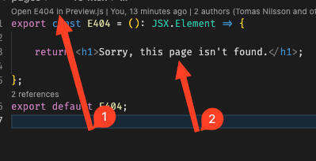
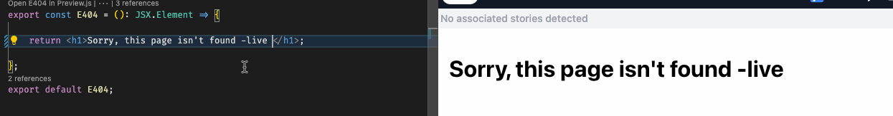

# ReactPlate

This project has been preconfigured to be a fast startup project showing some basic features such as scss, Routing with *v6* of `react-router-dom` and React 18.

The complete list is:

* Bootstrapped with [Create React App](https://github.com/facebook/create-react-app).
* Configured to use TypeScript
  * `tsc -b -v -w -i`  runs without errors
  * `tsconfig.json` has been configured to have strict settings
* `eslint` **v8** is configured with airbnb (`eslint-config-airbnb-typescript`).
* Includes demo usage of `react-router-dom` **version 6**. Examples include:
  * Normal routes
  * Subroutes
  * 404 error handling
* Demonstates how to use [css modules](https://create-react-app.dev/docs/adding-a-css-modules-stylesheet/) and includes an example of how to use `sass` in css.
* Has smart examples of how to use TypeScript props (rather than React Props) (see `Article.tsx`)
* An example `.env` is already configured.
* npm scripts default exists and  commands for `eslint` has been added:
  * npm start eslint
  * npm start eslint:fix
* .gitignore is simple and clean

## preview.js

Finally it has been configured to use [React Preview](https://previewjs.com/). Install the plugin and click the preview.js link above any component. The magic is shown when you edit something in the component.

Click here and and text:

Edit gives live updates without saving:

# Enjoy :)
